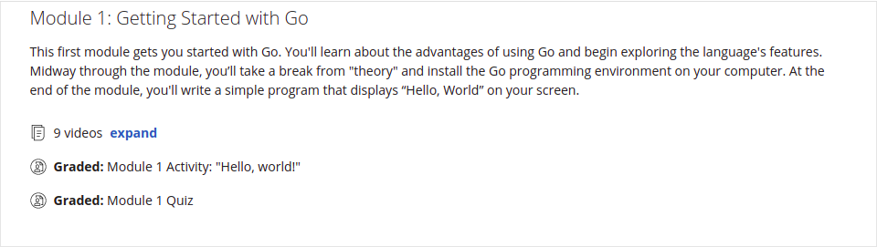
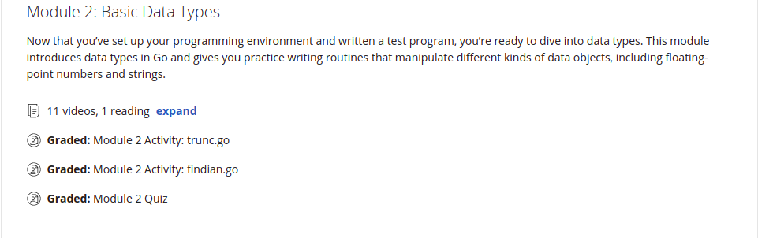
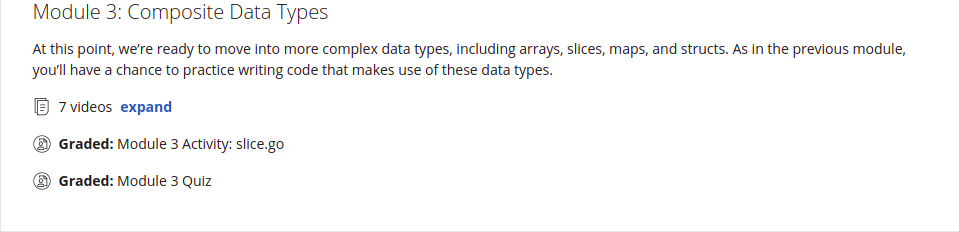
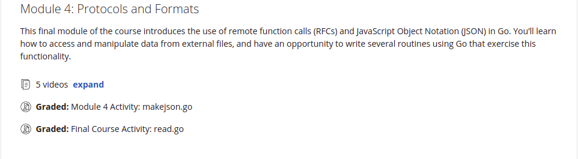

## Getting Started with Go: University of California, Irvine
- Corurse Link: [https://www.coursera.org/learn/golang-getting-started/home/info](https://www.coursera.org/learn/golang-getting-started/home/info)

---

### Week 01 | [`Getting Started with Go`](./Week-01)

### Week 02 | [`Basic Data Types`](./Week-02)

### Week 03 | [`Composite Data Types`](./Week-03)

### Week 04 | [`Protocols and Formats`](./Week-04)
